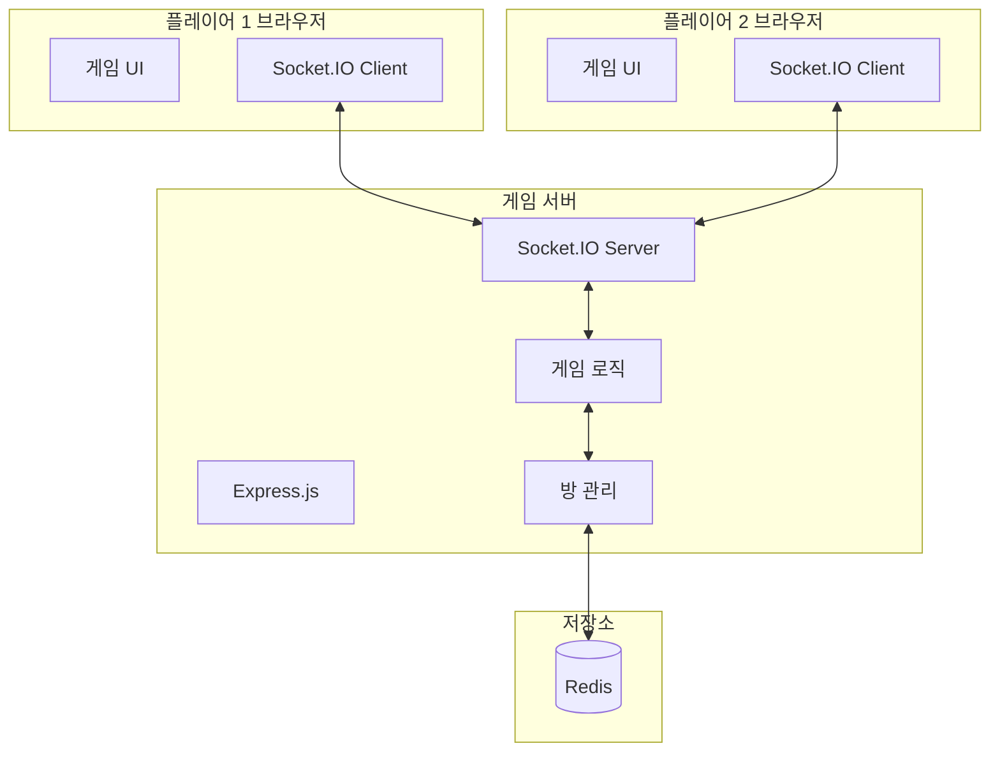
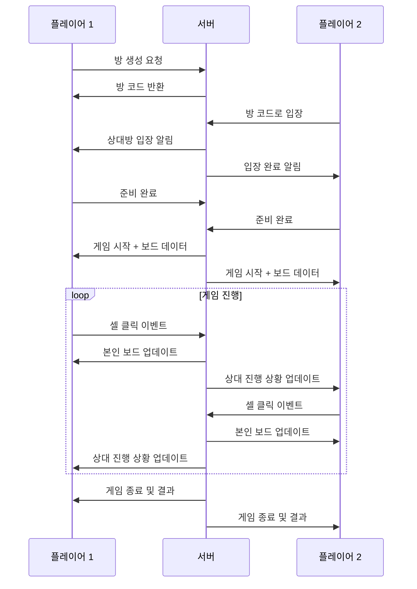

# 멀티플레이 지뢰찾기 PRD (Product Requirements Document)

## 1. 개요

### 1.1 제품 비전
웹 기반 실시간 멀티플레이 지뢰찾기 게임으로, 두 플레이어가 각자의 보드에서 동시에 플레이하며 상대방의 진행 상황을 실시간으로 확인할 수 있는 경쟁형 게임입니다.

### 1.2 목표
- 클래식 지뢰찾기의 재미에 경쟁 요소 추가
- 실시간 대전을 통한 긴장감과 몰입감 제공
- 누구나 쉽게 접근할 수 있는 웹 기반 플랫폼

### 1.3 타겟 사용자
- 클래식 지뢰찾기를 즐기는 사용자
- 친구와 실시간 대전을 원하는 사용자
- 캐주얼 웹 게임을 즐기는 모든 연령대

---

## 2. 핵심 기능

### 2.1 게임 모드

#### 2.1.1 1:1 실시간 대전
- 두 플레이어가 **동일한 조건의 보드**에서 각자 플레이
- 같은 지뢰 배치, 같은 보드 크기
- 먼저 클리어하는 플레이어가 승리
- 한 플레이어가 지뢰를 밟으면 상대방 자동 승리

#### 2.1.2 난이도 설정
| 난이도 | 보드 크기 | 지뢰 개수 |
|--------|-----------|-----------|
| 초급 | 9 x 9 | 10 |
| 중급 | 16 x 16 | 40 |
| 고급 | 30 x 16 | 99 |
| 커스텀 | 사용자 지정 | 사용자 지정 |

### 2.2 실시간 상태 공유

#### 2.2.1 상대방 보드 미리보기
- 상대방 보드의 **진행 상황**을 실시간으로 표시
- 표시 정보:
  - 열린 셀의 위치 (숫자는 가림)
  - 깃발을 꽂은 위치
  - 전체 진행률 (열린 셀 비율)

#### 2.2.2 실시간 정보 패널
- 상대방 경과 시간
- 상대방 깃발 사용 개수
- 상대방 클릭 횟수
- 연결 상태 표시

### 2.3 매칭 시스템

#### 2.3.1 방 생성 및 참여
- **방 코드 생성**: 6자리 영숫자 코드 생성
- **방 코드 입력**: 친구가 공유한 코드로 입장
- **빠른 매칭**: 랜덤 상대와 자동 매칭 (향후 확장)

#### 2.3.2 대기실
- 방장이 난이도 선택
- 양쪽 모두 준비 완료 시 게임 시작
- 채팅 기능 (선택적)

### 2.4 게임 플레이

#### 2.4.1 기본 조작

| 조작 | 기능 | 설명 |
|------|------|------|
| **좌클릭** | 셀 열기 | 숨겨진 셀을 열어 내용 확인 |
| **우클릭** | 깃발 꽂기/제거 | 지뢰로 의심되는 셀에 🚩 표시 |
| **좌+우 동시 클릭** | Chord (자동 열기) | 숫자 셀 주변의 미공개 셀 자동 열기 |
| **휠(미들) 클릭** | Chord (자동 열기) | 양클릭과 동일한 기능 |
| **더블클릭** | Chord (자동 열기) | 양클릭과 동일한 기능 |

#### 2.4.2 Chord 기능 상세
- **작동 조건**: 숫자 셀 주변에 꽂힌 깃발 수가 해당 숫자와 일치해야 함
- **동작**: 조건 충족 시, 깃발이 없는 주변 셀들을 자동으로 열어줌
- **주의**: 깃발이 잘못 꽂혀있으면 지뢰가 폭발할 수 있음
- **예시**: "3" 셀 주변에 깃발 3개 → 양클릭 시 나머지 5개 셀 자동 열기

#### 2.4.3 승리/패배 조건
- **승리**:
  - 모든 안전한 셀을 먼저 열면 승리
  - 상대방이 지뢰를 밟으면 승리
  - 상대방이 연결 끊김 시 승리 (일정 시간 후)
- **패배**:
  - 지뢰를 밟으면 패배
  - 상대방이 먼저 클리어하면 패배

### 2.5 관전 모드

#### 2.5.1 관전 기능
- 진행 중인 게임을 **실시간으로 관전** 가능
- 방 코드를 통해 관전자로 입장
- 관전자 수 제한: 최대 10명

#### 2.5.2 관전자 화면
- 양쪽 플레이어의 보드를 **동시에** 확인
- 각 플레이어의 실시간 진행 상황 표시
- 관전자는 게임에 영향을 줄 수 없음

#### 2.5.3 관전자 정보
- 현재 관전자 수 표시
- 관전자 닉네임 목록 (선택적)
- 관전자 입장/퇴장 알림

---

## 3. 시스템 아키텍처

### 3.1 기술 스택 (권장)

#### Frontend
- **프레임워크**: React 또는 Vue.js
- **실시간 통신**: Socket.IO Client
- **스타일링**: Tailwind CSS 또는 CSS Modules
- **상태 관리**: Zustand 또는 Redux

#### Backend
- **런타임**: Node.js
- **프레임워크**: Express.js
- **실시간 통신**: Socket.IO
- **데이터베이스**: Redis (세션/방 관리), MongoDB (사용자 데이터 - 선택적)

### 3.2 시스템 구성도



### 3.3 데이터 흐름



---

## 4. 화면 구성

### 4.1 메인 화면
- 게임 로고 및 제목
- 방 만들기 버튼
- 방 코드 입력 필드 + 참여 버튼
- 게임 설명/규칙 링크

### 4.2 대기실 화면
- 방 코드 표시 (복사 버튼 포함)
- 난이도 선택 (방장만)
- 플레이어 목록 및 준비 상태
- 준비/준비 취소 버튼
- 게임 시작 버튼 (양쪽 준비 시 활성화)
- 나가기 버튼

### 4.3 게임 화면

```
+------------------------------------------+
|  [타이머: 00:30]    [나가기]              |
+------------------------------------------+
|                    |                      |
|    내 보드         |    상대방 보드        |
|    (인터랙티브)     |    (미리보기)         |
|                    |                      |
|   지뢰: 10 🚩: 3   |   진행률: 45%        |
|                    |   🚩: 5              |
+------------------------------------------+
|            [이모지 리액션]                |
+------------------------------------------+
```

### 4.4 관전 화면

```
+------------------------------------------+
|  [타이머: 00:30]  [관전자: 3명]  [나가기]  |
+------------------------------------------+
|                    |                      |
|   플레이어 1 보드   |   플레이어 2 보드     |
|   진행률: 65%      |   진행률: 45%        |
|   🚩: 3           |   🚩: 5              |
|                    |                      |
+------------------------------------------+
|        [실시간 이벤트 로그 - 선택적]       |
+------------------------------------------+
```

### 4.5 결과 화면
- 승패 표시
- 양측 통계 비교 (시간, 클릭 수, 정확도)
- 재대결 버튼
- 메인으로 버튼

---

## 5. API 설계

### 5.1 Socket.IO 이벤트

#### 클라이언트 → 서버
| 이벤트 | 설명 | 페이로드 |
|--------|------|----------|
| `create-room` | 방 생성 | `{ nickname }` |
| `join-room` | 방 참여 | `{ roomCode, nickname }` |
| `set-difficulty` | 난이도 설정 | `{ difficulty }` |
| `player-ready` | 준비 상태 토글 | - |
| `start-game` | 게임 시작 | - |
| `cell-click` | 셀 좌클릭 | `{ x, y }` |
| `cell-flag` | 셀 우클릭 | `{ x, y }` |
| `cell-chord` | 양클릭 | `{ x, y }` |
| `leave-room` | 방 나가기 | - |
| `spectate-room` | 관전 입장 | `{ roomCode, nickname }` |

#### 서버 → 클라이언트
| 이벤트 | 설명 | 페이로드 |
|--------|------|----------|
| `room-created` | 방 생성 완료 | `{ roomCode }` |
| `room-joined` | 방 참여 완료 | `{ roomInfo }` |
| `player-joined` | 상대 입장 | `{ player }` |
| `player-left` | 상대 퇴장 | `{ playerId }` |
| `ready-changed` | 준비 상태 변경 | `{ playerId, ready }` |
| `game-started` | 게임 시작 | `{ board, startTime }` |
| `board-update` | 내 보드 업데이트 | `{ cells, gameOver, won }` |
| `opponent-update` | 상대 진행 업데이트 | `{ progress, flags, openedCells }` |
| `game-over` | 게임 종료 | `{ winner, stats }` |
| `spectator-joined` | 관전자 입장 | `{ spectator, count }` |
| `spectator-left` | 관전자 퇴장 | `{ spectatorId, count }` |
| `spectate-update` | 관전자용 양쪽 보드 업데이트 | `{ player1Board, player2Board }` |
| `error` | 에러 발생 | `{ message }` |

### 5.2 데이터 구조

#### Room (방)
```typescript
interface Room {
  code: string;
  host: string;
  players: Player[];
  spectators: Spectator[];
  difficulty: Difficulty;
  status: 'waiting' | 'playing' | 'finished';
  board: MineBoard;
  startTime?: number;
}
```

#### Player (플레이어)
```typescript
interface Player {
  id: string;
  nickname: string;
  ready: boolean;
  board: PlayerBoard;
  stats: PlayerStats;
}
```

#### PlayerBoard (플레이어 보드 상태)
```typescript
interface PlayerBoard {
  revealed: boolean[][];
  flagged: boolean[][];
  gameOver: boolean;
  won: boolean;
}
```

#### Spectator (관전자)
```typescript
interface Spectator {
  id: string;
  nickname: string;
  joinedAt: number;
}
```

---

## 6. 개발 단계

### Phase 1: MVP (핵심 기능) ✅ 완료
- [x] 프로젝트 초기 설정
- [x] 기본 지뢰찾기 게임 로직 구현
- [x] 방 생성/참여 기능
- [x] 실시간 게임 동기화
- [x] 기본 UI 구현
- [x] 승패 판정
- [x] 관전 모드 기능
- [x] 양클릭(Chord) 기능 구현

### Phase 2: 사용자 경험 개선
- [x] 반응형 디자인
- [ ] 애니메이션 및 효과음
- [ ] 이모지 리액션
- [x] 재대결 기능

### Phase 3: 확장 기능
- [ ] 빠른 매칭 시스템
- [ ] 사용자 계정 및 통계
- [ ] 랭킹 시스템

---

## 7. 비기능적 요구사항

### 7.1 성능
- 실시간 통신 지연: 100ms 이하
- 페이지 로드 시간: 3초 이하
- 동시 접속자: 초기 100명 지원

### 7.2 보안
- 게임 로직은 서버에서 처리 (클라이언트 조작 방지)
- 방 코드 무작위 생성 및 충돌 방지
- WebSocket 연결 검증

### 7.3 호환성
- 최신 브라우저 지원 (Chrome, Firefox, Safari, Edge)
- 데스크톱 및 모바일 반응형 지원

---

## 8. 용어 정의

| 용어 | 설명 |
|------|------|
| 셀 (Cell) | 보드의 각 칸 |
| 깃발 (Flag) | 지뢰로 의심되는 셀에 표시 |
| 진행률 | 열린 안전한 셀 / 전체 안전한 셀 |
| 방 코드 | 게임 방을 식별하는 고유 코드 |
| Chord | 숫자 셀 주변의 깃발 수가 일치할 때 나머지 셀을 자동으로 여는 동작 |

---

## 9. 리스크 및 고려사항

### 9.1 기술적 리스크
- **네트워크 지연**: WebSocket을 통한 실시간 통신에서 지연 발생 가능
  - 대응: 클라이언트 측 예측 및 보간 처리
- **연결 끊김**: 게임 중 플레이어 연결 끊김
  - 대응: 재연결 로직 및 일정 시간 대기 후 자동 패배 처리

### 9.2 사용자 경험 리스크
- **부정 행위**: 클라이언트 조작을 통한 치팅
  - 대응: 모든 게임 로직을 서버에서 처리
- **매칭 실패**: 상대방을 찾지 못하는 경우
  - 대응: 방 코드 공유 방식으로 친구와 직접 매칭

---

## 10. 성공 지표 (KPI)

- 일일 활성 사용자 (DAU)
- 평균 게임 세션 시간
- 재대결 비율
- 사용자 재방문율

---

*문서 버전: 1.1*
*최종 수정일: 2025-12-31*
*변경사항: 기본 조작 테이블 추가, Chord 기능 상세 설명 추가, 개발 단계 완료 표시*
